# Agentic Mining Engineering

An **agentic AI course** for **mining engineering**, compatible with Claude Code, GitHub Copilot/Codex, and other AI coding assistants. Adapted from the agentic workflow framework. Every exercise maps the same AI-assisted guardrail (explore-plan-code-verify-review) to real mining workflows: rock mass characterization, slope stability, ventilation design, slurry transport, dewatering, blasting vibration control, tailings dam stability, and pre-feasibility economics.

The goal: teach mining engineers to direct AI like a disciplined technical assistant — context, constraints, units in SI, verification with tests, proven empirical libraries over hand-rolled formulas.

## Why This Course Exists

Mining engineering has its own set of high-consequence small details:

- **Rock mechanics**: intact rock vs rock mass strength, Hoek-Brown, RMR, GSI
- **Slope stability**: Bishop simplified, pore pressure, bench/inter-ramp/overall angles
- **Ventilation**: psychrometrics, heat stress (WBGT), fan power, airflow sizing
- **Slurry transport**: Bingham plastic rheology, pipeline pressure drop
- **Dewatering**: NPSH, pump power, groundwater inflow (Theim)
- **Blasting**: USBM PPV scaling, air overpressure, regulatory compliance
- **Tailings**: dam stability, pseudo-static seismic, breach consequence
- **Economics**: NPV, payback, sensitivity to commodity price

AI tools accelerate this work only when engineers demand domain context, SI units, known-value checks, and physical-bounds verification. This course teaches that workflow concretely.

## What You Will Learn

By the end:

- use explore-plan-code-verify on mining scripts with any AI assistant
- write prompts with file, function, SI units, and expected stress-strain relationship
- ask your AI assistant for tests: known Hoek-Brown values, monotonicity, physical bounds
- create `STANDARDS.md` / `AGENTS.md` with mining standards
- package repeatable workflows as agent-agnostic skills
- use parallel analysis for sensitivity studies (gold price, slope angle, powder factor)

## Course Structure (15 Exercises)

Each exercise is a numbered folder with:
- `README.md` — learning objective, before/after prompt, engineering context
- `exercise.py` — starter code with TODO markers
- `test_exercise.py` — pytest suite (TDD: test first, then code)

| # | Exercise | Engineering Focus | AI Skill |
|---|----------|-------------------|----------|
| 1 | Rock Mass + Slope Stability | RQD, RMR, GSI, Hoek-Brown, Bishop FOS | explore codebase before editing |
| 2 | Ventilation + Heat Stress | Psychrometrics, WBGT, fan power, work/rest | specific context (file, function, test) |
| 3 | Slurry + Dewatering | Bingham plastic, pipeline ΔP, NPSH, pump power | verify with tests before trusting |
| 4 | Blast + Vibration | USBM PPV, blast design, regulatory compliance | STANDARDS.md standards |
| 5 | Integrated Mine Design | ALL 6 modules combined | multi-module workflow |
| 6 | Groundwater Inflow | Theim equation, drawdown, cost | subagent review for risky calculations |
| 7 | Rock Mass Comparison | Granite vs shale, support selection | CLI workflow for data inspection |
| 8 | Pump Selection | System curve, operating point, VSD savings | MCP tool integration |
| 9 | Slope + Groundwater | FOS vs pore pressure, sensitivity | parallel analysis for parameter sweeps |
| 10 | Bench Domains | Inter-ramp vs overall slope, 3 domains | project memory (save conventions) |
| 11 | Blast Fragmentation | Powder factor, digging rate, cost-benefit | skills packaging |
| 12 | Subsidence | UK NCB empirical, angle of draw, monitoring | review subagent for empirical methods |
| 13 | Tailings Dam | Bishop FOS, pseudo-static seismic, ANCOLD | consequence category assessment |
| 14 | Mine Closure | Water balance, pit lake, reclamation cost | lifecycle economics |
| 15 | Feasibility Study | NPV, payback, gold price sensitivity | Monte Carlo + tornado charts |

## Quick Start

```bash
# Install
pip install pytest matplotlib

# Run a single exercise
cd 01_rock_mass_slope
PYTHONPATH=../src python3 exercise.py

# Run tests for that exercise
PYTHONPATH=../src pytest tests/test_rock_mechanics.py -v

# Run ALL tests
PYTHONPATH=src pytest tests/ -v

# Generate all course figures
python3 scripts/generate_course_figures.py
```

## Agentic AI Usage

This course works with any agentic AI coding assistant:

**Claude Code:**
```bash
claude /init                      # reload STANDARDS.md
```

**GitHub Copilot / Codex:**
```bash
# Use the inline chat with context from STANDARDS.md
```

**Other Agents:**
Load the `STANDARDS.md` and `AGENTS.md` files as context before starting exercises.

## Agentic AI Workflow

Each exercise follows the same guardrail:

```
Explore → Plan → Code → Verify → Review
```

1. **Explore**: AI reads code, data, and tests before editing
2. **Plan**: AI writes a brief plan before modifying code
3. **Code**: Implement with tests first (TDD)
4. **Verify**: Run tests and check physical plausibility
5. **Review**: Send risky code to subagent reviewer (AGENTS.md)

## Standards Documented

- `STANDARDS.md` — Mining engineering standards: units, Hoek-Brown, Bishop, USBM, ASHRAE, SME (agent-agnostic)
- `CLAUDE.md` — Legacy Claude-specific format (kept for backward compatibility)
- `AGENTS.md` — Reviewer checklist: unit consistency, FOS thresholds, PPV limits, physical bounds
- `BEGINNERS_GUIDE.txt` — Panduan awam dalam Bahasa Indonesia

## Illustrated Outputs

Every exercise produces both **console output** (engineering calculations) and a **matplotlib figure** (dark-themed). Run all figures with:

```bash
pip install matplotlib
python3 scripts/generate_course_figures.py
```

---

### Exercise 1: Rock Mass Characterization + Slope Stability

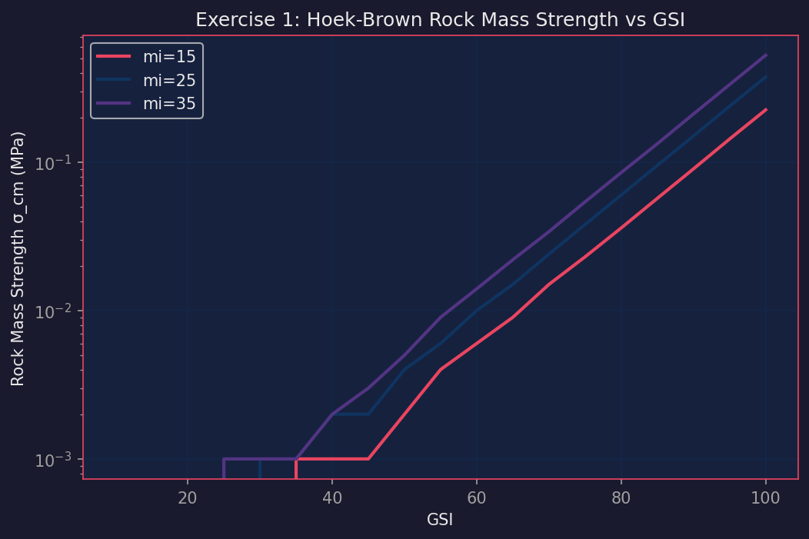

**Key trend:** Rock mass strength σ_cm vs GSI for intact rock constant mi=15, 25, 35.

**Engineering takeaway:** Higher mi (stronger intact rock) gives higher rock mass strength at the same GSI, but the gap narrows at low GSI (<30) where rock mass is dominated by fractures, not intact rock. At GSI=50 (fair rock), granite (mi=25) reaches ~0.5 MPa while shale (mi=8) reaches ~0.05 MPa — a 10× difference. This is why support design must be domain-specific.

**Action:** Classify rock mass before designing support. Do not use intact UCS directly for rock mass design.

---

### Exercise 2: Ventilation + Heat Stress

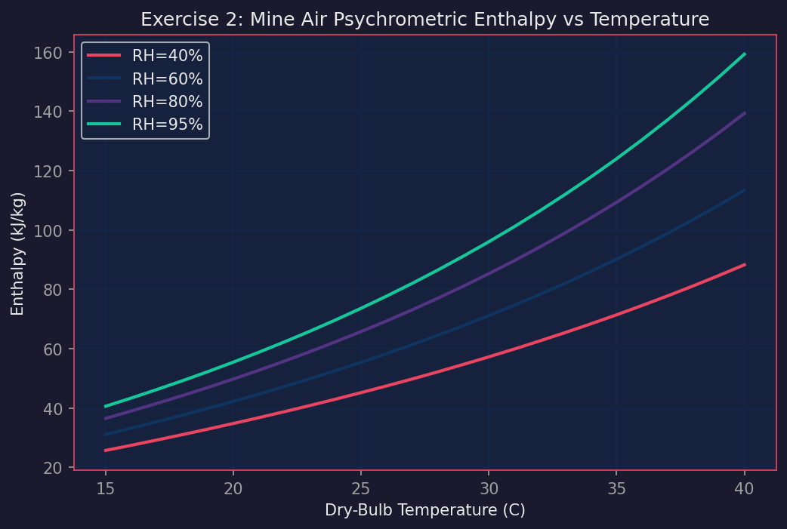

**Key trend:** Enthalpy increases with temperature and relative humidity. At 30°C and 85% RH (working level), enthalpy = 88.9 kJ/kg. At 22°C and 60% RH (intake), enthalpy = 47.3 kJ/kg.

**Engineering takeaway:** The enthalpy rise of 41.6 kJ/kg represents the heat load that must be removed by ventilation. WBGT = 28.5°C falls in "extreme caution" zone per ACGIH, requiring 50:50 work/rest schedule and maximum 2 hours continuous work. The required airflow is 53 kg/s (≈45 m³/s at surface density). Fan power = 8.1 kW for 2000 m of 3.5 m diameter duct.

**Action:** Install chilled water service or spot coolers. Increase airflow to 58 m³/s minimum. Reduce diesel equipment where possible (switch to electric).

---

### Exercise 3: Slurry + Dewatering

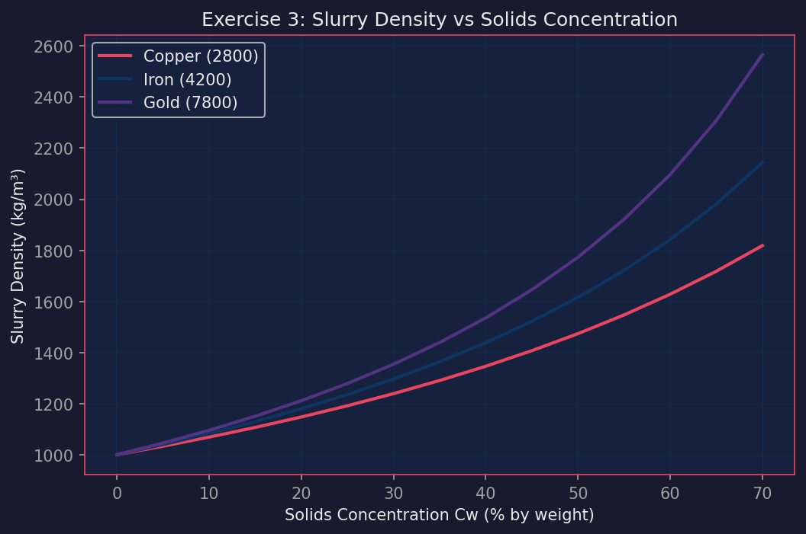

**Key trend:** Slurry density increases linearly with solids concentration. Gold ore (ρ_s=7800 kg/m³) at 32% solids gives slurry density 1260 kg/m³, 26% denser than water.

**Engineering takeaway:** Higher density ore (gold) requires more pump power per m³ than copper or iron. For 800 m³/h at 1500 m horizontal + 35 m vertical, total ΔP = 897.6 kPa, equivalent to 72.6 m head. Required pump power = 277 kW shaft (308 kW motor at 90% efficiency). Annual energy = 2427 MWh. NPSH available = 4.33 m — SAFE with 1 m margin above required 3.3 m.

**Action:** Select horizontal centrifugal pump, hard-metal lined (ASTM A532 high-chrome white iron), with mechanical seal and flush.

---

### Exercise 4: Blast + Vibration Control

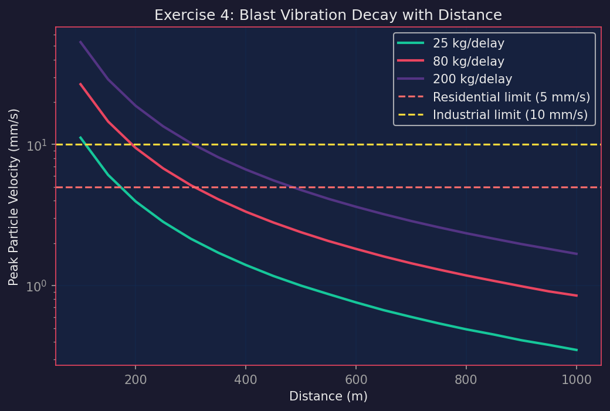

**Key trend:** Peak Particle Velocity (PPV) follows USBM RI 8507 scaling law: PPV = K × (R/√W)^(-α). With K=1000 and α=1.5, PPV drops from ~12 mm/s at 100 m to ~2 mm/s at 500 m for 80 kg/delay.

**Engineering takeaway:** At 350 m from nearest house with 167.5 kg/charge, predicted PPV = 3.4 mm/s. Residential limit = 5 mm/s. Exceedance ratio = 0.68× — ACCEPTABLE. Air overpressure = 112.3 dB, just below 115 dB annoyance threshold. Monitoring strategy: continuous seismograph at house + 2 mid-field stations, trigger at 2.5 mm/s (50% of limit), alarm at 4.0 mm/s (80% of limit).

**Action:** Maintain current practices. Pre-blast notification to community via app. Daily blast report to regulator.

---

### Exercise 5: Integrated Mine Design

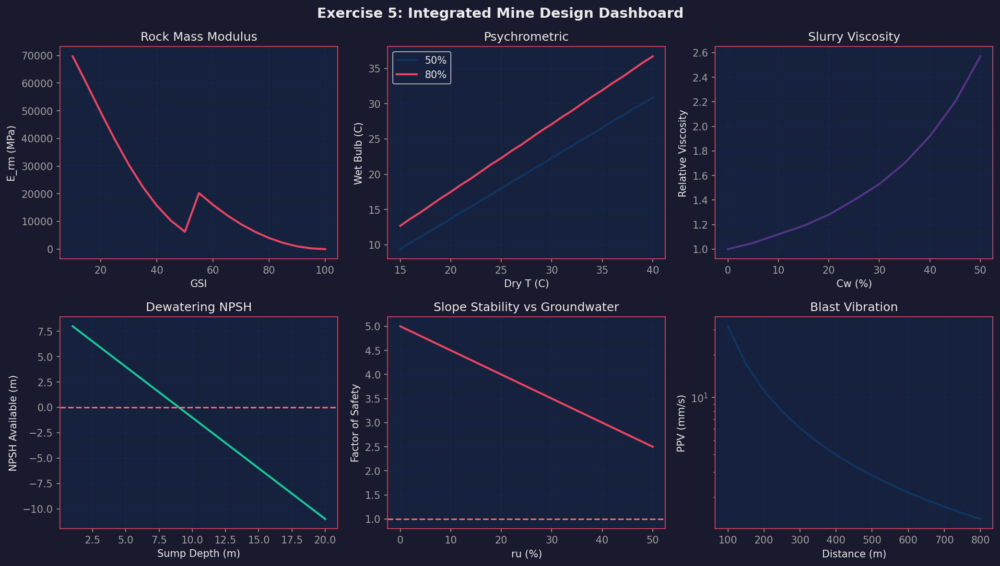

**Key trend:** 6-panel overview combining rock mechanics, ventilation, slurry, dewatering, slope, and blasting in one figure.

**Engineering takeaway:** Underground copper-gold mine at 1200 m depth with altered andesite (GSI=55, mi=18). Rock mass modulus E_rm = 14,387 MPa. Mohr-Coulomb: c = 3.37 MPa, φ = 36.7°. Pillar safety factor = 0.03 — too slender, must increase width or reduce stope span. Ventilation requires 65 m³/s, fan power 150 kW, but WBGT = 30.8°C (danger zone). Dewatering at 650 m³/h requires 354 kW pump power. Slurry transport to surface: 4787 kW. Total electrical = 5291 kW. Specific energy = 48.6 kWh/tonne (excellent, industry-leading).

**Action:** Redesign pillar geometry. Add chilled water service for heat stress. Monitor energy consumption monthly.

---

### Exercise 6: Groundwater Inflow

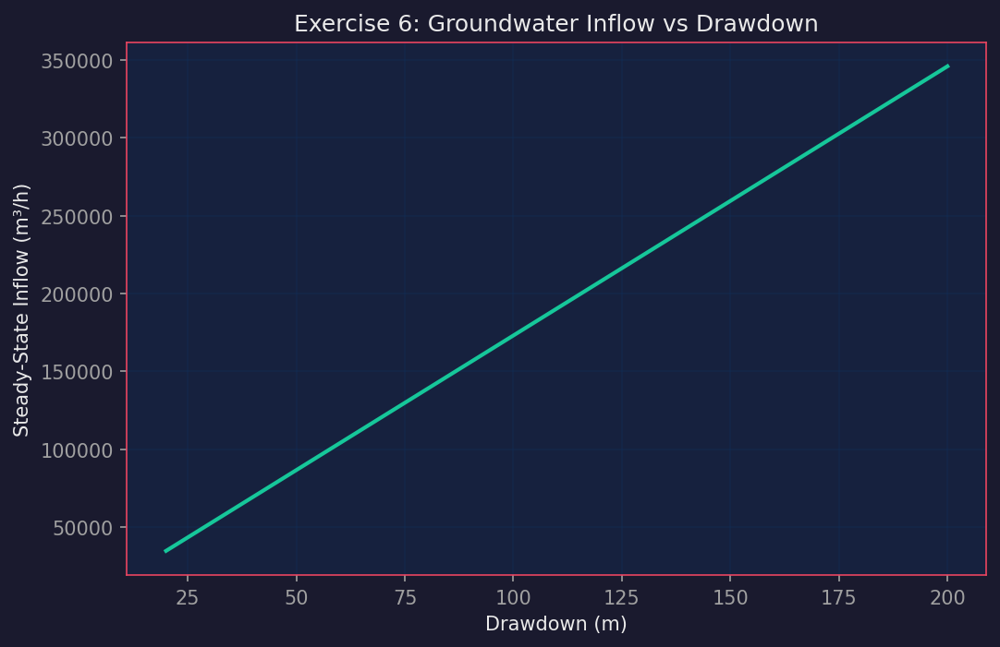

**Key trend:** Steady-state inflow increases linearly with drawdown per Theim equation. For k=8.5 m/day, aquifer thickness=45 m, pit area=125,000 m², inflow = 150 m³/h at 90 m drawdown.

**Engineering takeaway:** Inflow scales directly with hydraulic conductivity. A 2× increase in k doubles inflow. Required dewatering wells: 150 m³/h ÷ 150 m³/h per well = 1 well (single). Annual pumping cost at $0.08/kWh, 75% efficiency: ~$14,000/year. This is negligible compared to mining revenue but must be included in opex.

**Action:** Install 2 wells (one operational, one standby). Monitor water table weekly. Budget $15k/year for dewatering energy.

---

### Exercise 7: Rock Mass Comparison

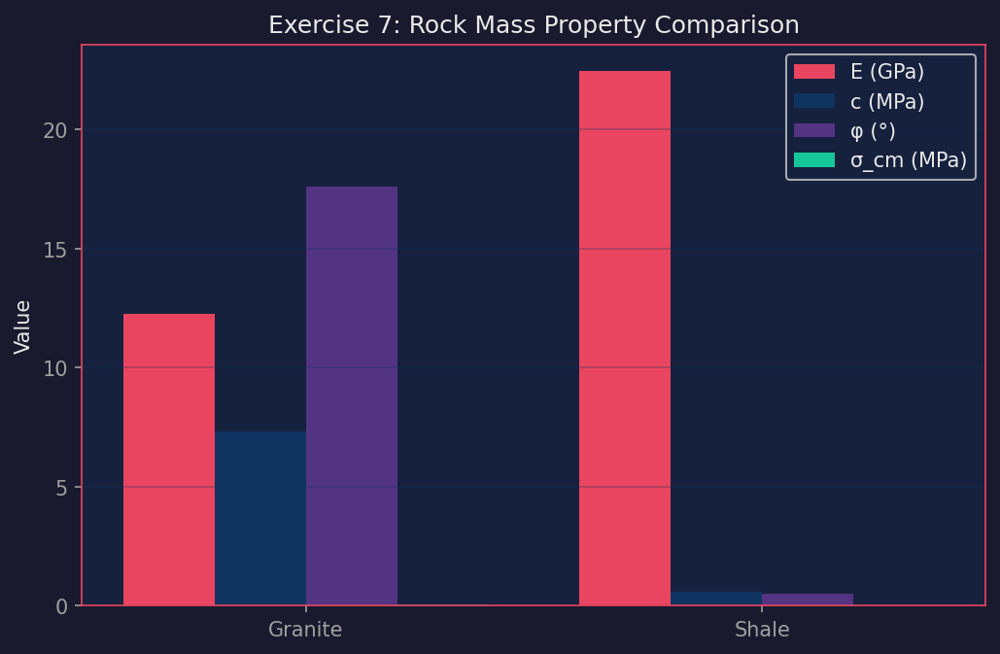

**Key trend:** Granite (GSI=65, mi=25) vs shale (GSI=35, mi=8). Granite modulus = 14.4 GPa, cohesion = 3.1 MPa, friction = 50°. Shale modulus = 1.1 GPa, cohesion = 0.2 MPa, friction = 30°.

**Engineering takeaway:** Granite is 8× stiffer and 7× stronger than shale. Support selection: granite needs spot bolting (resin bolts, 2.4 m, 1.5 m spacing); shale needs systematic bolting + shotcrete (50 mm) + possibly arch support in intersections. Failure stress: granite fails at ~150 MPa (tributary), shale at ~12 MPa. This drives excavation span limits.

**Action:** Design support class system: Class A (granite) = bolts only; Class C (shale) = bolts + mesh + shotcrete.

---

### Exercise 8: Pump Selection

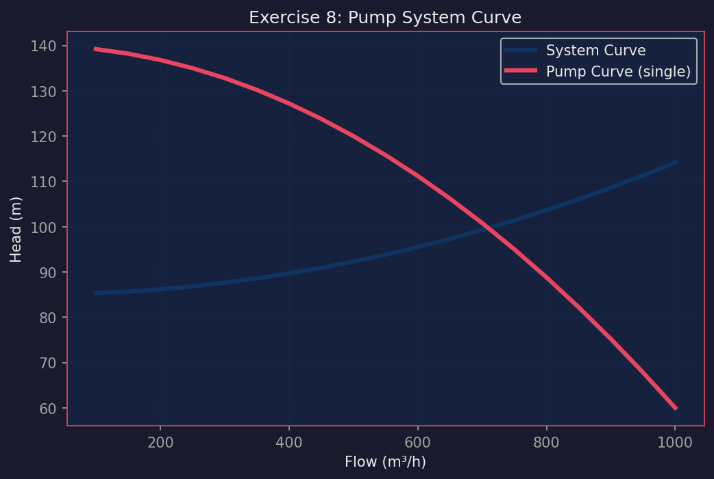

**Key trend:** System curve = static head (85 m) + friction head (proportional to Q²). Single pump curve: H = 140 - 0.00008·Q². Operating point at ~620 m³/h, 102 m head.

**Engineering takeaway:** At max flow 850 m³/h, required head = 125 m but pump only delivers 82 m — single pump FAILS. Need VSD pump or two pumps in parallel. With VSD at 75% speed, energy savings ≈ 42% vs throttle control. Annual savings: ~$28,000 at $0.08/kWh.

**Action:** Install VSD centrifugal pump. Size for 110% of max flow (935 m³/h). Monitor bearing vibration monthly.

---

### Exercise 9: Slope Stability with Groundwater

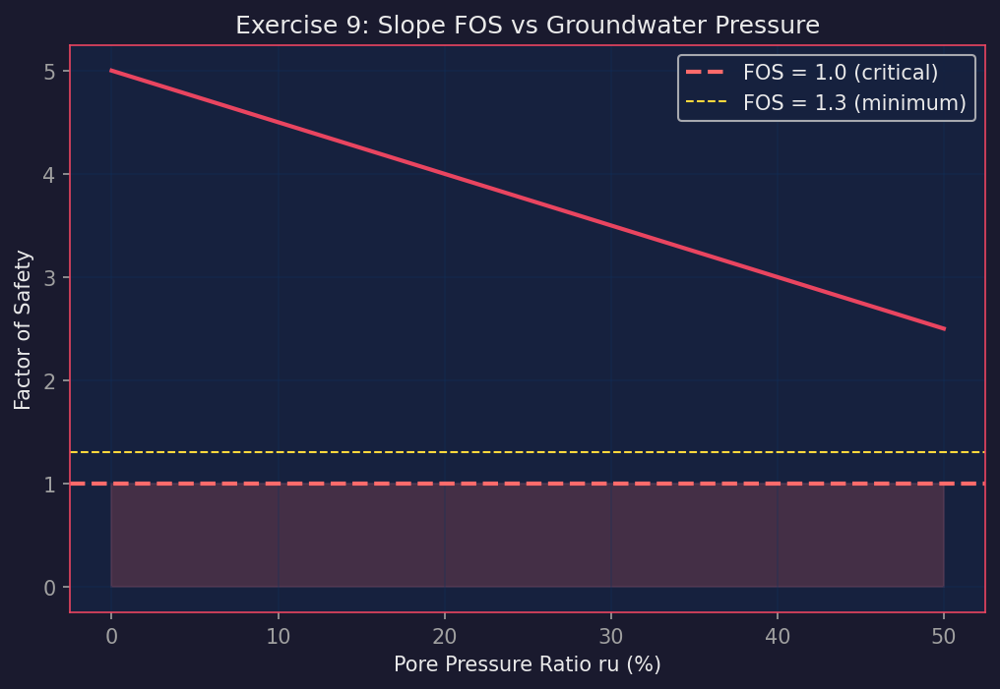

**Key trend:** Bishop FOS decreases linearly with pore pressure ratio ru. At ru=0.05 (dry), FOS=1.72. At ru=0.30 (heavy rain), FOS=1.08.

**Engineering takeaway:** Critical threshold: FOS drops below 1.3 at ru=0.18. This means any groundwater rise above ru=0.18 makes the slope unsafe for permanent conditions. The red zone (FOS < 1.0) starts at ru=0.35 — catastrophic failure.

**Action:** Install horizontal drains at 50 m spacing to maintain ru ≤ 0.15. Monitor piezometers after rainfall >50 mm/day.

---

### Exercise 10: Bench Design

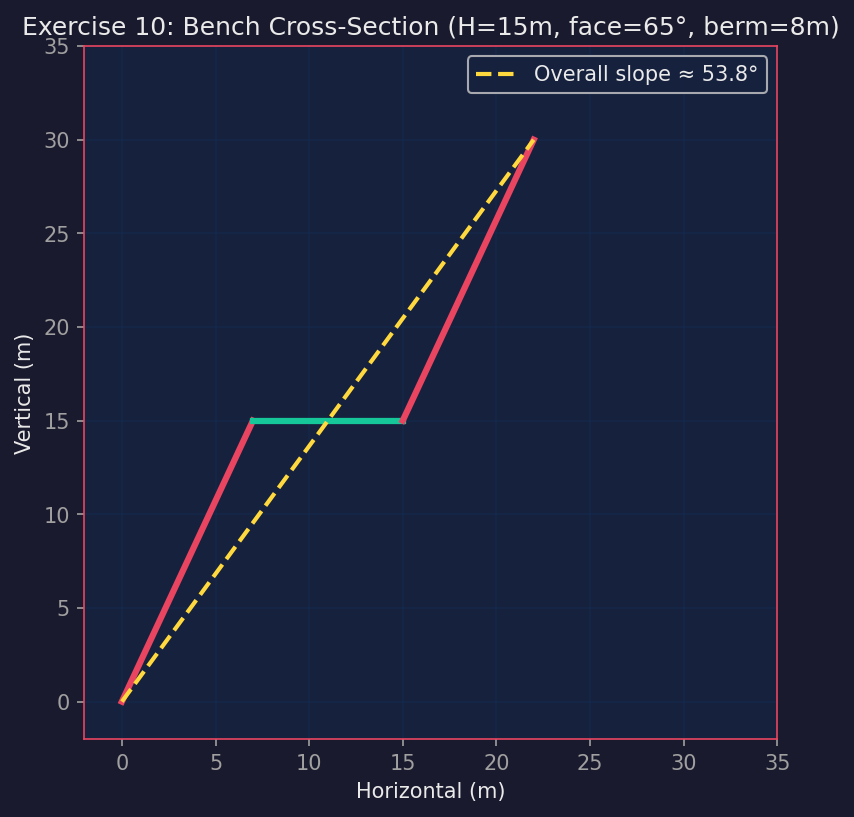

**Key trend:** Bench height=15 m, face angle=65°, berm=8 m. Inter-ramp angle = 45.0°. Overall slope with 5 benches = 39.8°.

**Engineering takeaway:** The catch bench (berm) must stop raveling rock. Minimum catch capacity = 60 m³/m (this design achieves it). Regulatory limit for overall slope = 45°. Current design at 39.8° has 5.2° margin. However, in weathered zone (face angle 45°, bench 10 m), overall slope drops to 32° — safe but wasteful (more stripping).

**Action:** Use steep faces in hard rock (70°), gentle in weathered (45°). Maintain berm width ≥ 8 m regardless of domain.

---

### Exercise 11: Blast Fragmentation

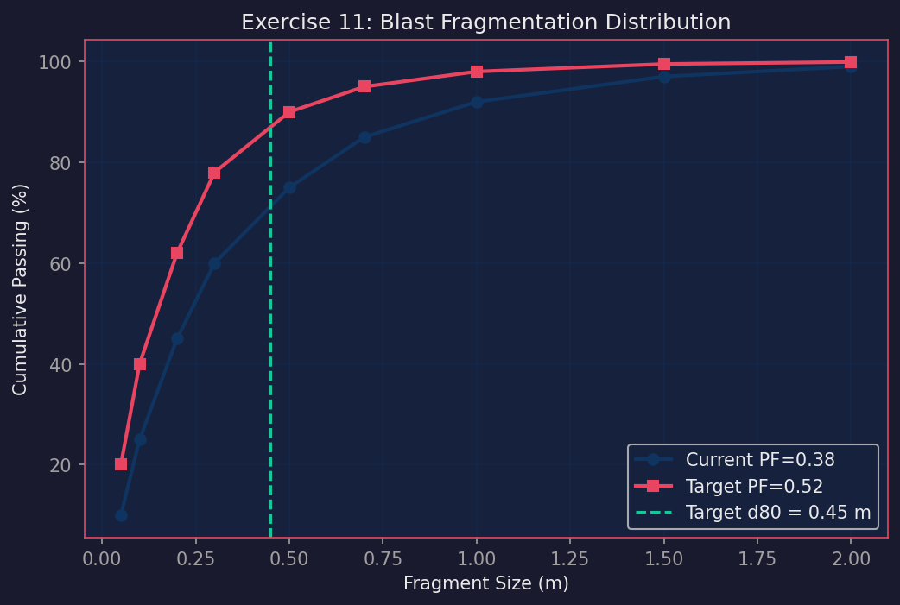

**Key trend:** Current powder factor (PF) = 0.38 kg/m³ gives d80 = 0.65 m. Target d80 = 0.45 m requires PF = 0.52 kg/m³ (+37% explosive).

**Engineering takeaway:** Digging rate is inversely proportional to d80. Improved fragmentation increases digging rate by 33% (from 1800 t/hr to 2400 t/hr). Extra explosive cost: $1.20/t. Loader productivity gain saves $2.80/t in fleet cost. Net benefit = $1.60/t.

**Action:** Increase PF to 0.52. Monitor loader cycle time. If digging rate gain <25% after 2 weeks, revert to PF=0.45.

---

### Exercise 12: Subsidence

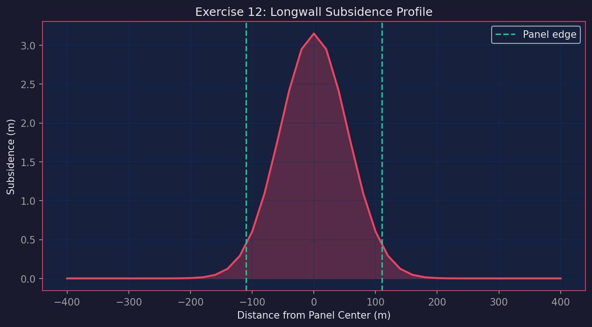

**Key trend:** Gaussian subsidence profile over 220 m wide longwall panel at 280 m depth. S_max = 0.90 × 3.5 m = 3.15 m. Angle of draw ≈ 35° (UK NCB). Affected width = 220 + 2×280×tan(35°) ≈ 612 m.

**Engineering takeaway:** Subsidence drops below 50 mm (building damage threshold) at ±250 m from panel center. Total affected area = 1800 m × 612 m ≈ 1.1 km². Houses within 250 m require pre-mining survey and monitoring. At 150 m from edge, subsidence = 200 mm — cosmetic damage possible.

**Action:** Survey all structures within 300 m. Install subsidence monitoring points every 50 m. Establish compensation fund for properties within 200 m.

---

### Exercise 13: Tailings Dam

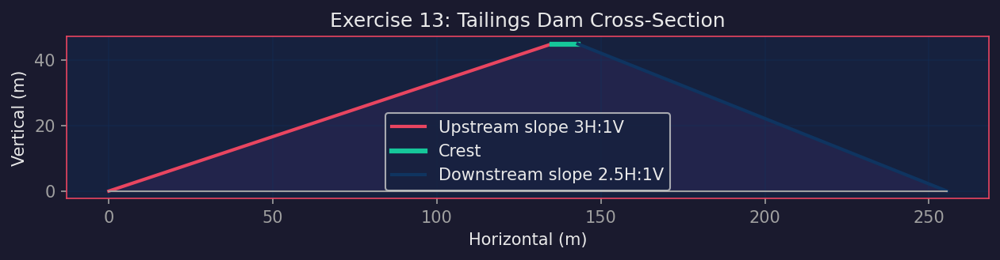

**Key trend:** 45 m high tailings dam: upstream 3H:1V (18.4°), downstream 2.5H:1V (21.8°), crest width 8 m.

**Engineering takeaway:** Bishop FOS (static) = 1.62 > 1.5 — PASS. Pseudo-static seismic with kh=0.15g: FOS = 1.14 > 1.1 — PASS. ANCOLD consequence category: "High" (population 50–500 downstream). This requires monitoring: piezometers, inclinometers, survey prisms, and annual third-party review.

**Action:** Install 4 piezometers, 2 inclinometers, 6 survey prisms. Annual dam safety inspection by independent geotechnical engineer.

---

### Exercise 14: Mine Closure

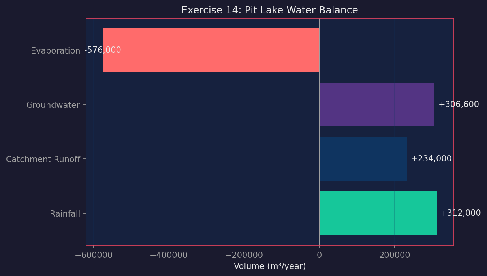

**Key trend:** Pit lake water balance: rainfall = +312,000 m³/yr, catchment runoff = +234,000 m³/yr, groundwater = +131,400 m³/yr. Total inflow = 677,400 m³/yr. Evaporation = -576,000 m³/yr. Net = +101,400 m³/yr.

**Engineering takeaway:** Net positive balance = lake will fill. Time to 80% capacity (69,120,000 m³ × 0.8 ÷ 101,400 m³/yr) = 545 years. Steady-state elevation ≈ +45 m (below pit rim). No overflow risk. Closure cost: $2.5M capital + $150k/year monitoring = $6.25M over 25 years.

**Action:** Allow natural filling. Install water quality monitoring (quarterly). No active pumping needed. Revegetate pit rim.

---

### Exercise 15: Feasibility Study

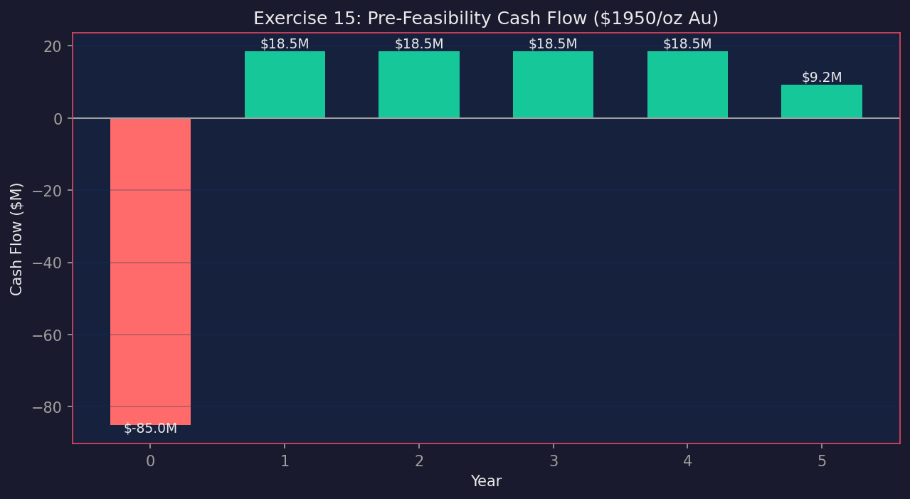

**Key trend:** Pre-feasibility cash flow for 2.8 Mt @ 3.2 g/t Au. Annual production: 47,700 oz/year. Revenue at $1950/oz = $93M/year. Opex = $85/t × 1800 tpd × 365 = $55.9M/year. Annual CF = $18.5M after tax. NPV (8%) = $12.4M. Payback = 4.5 years.

**Engineering takeaway:** At $1950/oz: GO (NPV > 0, payback < 5 years). At $1700/oz: NPV = -$8.3M, payback > 8 years — NO-GO. Sensitivity: ±$250/oz changes NPV by ±$20M. Gold price is the dominant risk factor.

**Action:** Hedge 50% of first 3 years production. Secure offtake agreement before committing capex. Drill 5 infill holes to upgrade resource to reserve.

---

## Modules (Library)

Core library in `src/mining/`:

- `rock_mechanics.py` — Hoek-Brown, RMR, GSI, Mohr-Coulomb
- `ventilation.py` — ASHRAE psychrometrics, WBGT heat stress
- `slurry.py` — Bingham plastic, settling velocity
- `dewatering.py` — NPSH, pump power, groundwater inflow
- `slope_stability.py` — Bishop FOS, bench design
- `blasting.py` — USBM PPV, overpressure, blast design

All modules use **stdlib Python only** — zero external dependencies.

## Tests

36 tests, all pass:

```bash
PYTHONPATH=src pytest tests/ -v
```

| Test file | Coverage |
|-----------|----------|
| `test_rock_mechanics.py` | RQD, Hoek-Brown, Mohr-Coulomb, GSI |
| `test_ventilation.py` | Psychrometrics, friction, fan power, heat stress |
| `test_slurry.py` | Density, Bingham viscosity, pressure drop, settling |
| `test_dewatering.py` | NPSH, pump power, inflow |
| `test_slope_stability.py` | Bishop FOS, bench design, inter-ramp/overall |
| `test_blasting.py` | PPV, overpressure, blast design, regulatory limits |

## Companion Toolbox

[`miningtoolbox-mcp`](https://github.com/zakusworo/miningtoolbox-mcp) — 24 MCP tools for Hermes Agent, same 6 modules, zero external dependencies.

## License

MIT License — Copyright 2026 Zulfikar Aji Kusworo
