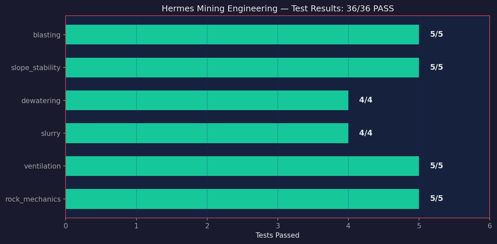

# Hermes Mining Engineering

Pure mining engineering calculations using empirical, industry-standard methods.

This repository implements:
- **Rock Mechanics**: Hoek-Brown, RMR, GSI, Mohr-Coulomb (ISRM/SME)
- **Ventilation**: ASHRAE psychrometrics, heat stress index (NIOSH/ACGIH)
- **Slurry Transport**: Bingham plastic rheology, settling velocity
- **Dewatering**: NPSH, pump power, groundwater inflow
- **Slope Stability**: Bishop simplified, bench design, inter-ramp/overall angles
- **Blasting**: USBM PPV, air overpressure, blast design

All modules use **stdlib Python only** — zero external dependencies.

## Standards Referenced

| Area | Standard | Module |
|------|----------|--------|
| Rock mechanics | Hoek-Brown (2002), RMR (Bieniawski), GSI | `rock_mechanics` |
| Ventilation | ASHRAE Fundamentals, McPherson (1993), NIOSH | `ventilation` |
| Slurry | Bingham plastic, Wilson et al. (2006), SME | `slurry` |
| Dewatering | SME Handbook, Hartman & Mutmansky | `dewatering` |
| Slope stability | Bishop simplified, SME, Hoek-Bray | `slope_stability` |
| Blasting | USBM RI 8507, AS 2187.2 | `blasting` |
| Heat stress | ACGIH TLV, NIOSH criteria | `ventilation.heat_stress_index` |
| Rock testing | ASTM D7012, D5731, D4543 | referenced in docs |
| Mine safety | MSHA regulations, ISO/TC 82 | referenced in docs |

## Quick Start

```bash
# No dependencies beyond Python standard library
cd hermes-mining-engineering
PYTHONPATH=src python3 -m pytest tests/ -v

# Run individual module demos
PYTHONPATH=src python3 src/mining/rock_mechanics.py
PYTHONPATH=src python3 src/mining/ventilation.py
PYTHONPATH=src python3 src/mining/slurry.py
PYTHONPATH=src python3 src/mining/dewatering.py
PYTHONPATH=src python3 src/mining/slope_stability.py
PYTHONPATH=src python3 src/mining/blasting.py

# Run exercises
PYTHONPATH=src python3 exercises/01_rock_mass_slope/exercise.py
PYTHONPATH=src python3 exercises/02_ventilation_heat_stress/exercise.py
PYTHONPATH=src python3 exercises/03_slurry_dewatering/exercise.py
PYTHONPATH=src python3 exercises/04_blast_vibration/exercise.py
PYTHONPATH=src python3 exercises/05_integrated_design/exercise.py
PYTHONPATH=src python3 exercises/06_groundwater_inflow/exercise.py
PYTHONPATH=src python3 exercises/07_rock_mass_comparison/exercise.py
PYTHONPATH=src python3 exercises/08_pump_selection/exercise.py
PYTHONPATH=src python3 exercises/09_slope_groundwater/exercise.py
PYTHONPATH=src python3 exercises/10_bench_domains/exercise.py
PYTHONPATH=src python3 exercises/11_blast_fragmentation/exercise.py
PYTHONPATH=src python3 exercises/12_subsidence/exercise.py
PYTHONPATH=src python3 exercises/13_tailings_dam/exercise.py
PYTHONPATH=src python3 exercises/14_mine_closure/exercise.py
PYTHONPATH=src python3 exercises/15_feasibility_study/exercise.py
```

## Modules

### `rock_mechanics.py`

```python
from mining import rock_mechanics as rm

# Hoek-Brown for granite rock mass
params = rm.hoek_brown_parameters(gsi=65, mi=25, D=0.5)
# → mb, s, a, E_rm_MPa

# Strength at confining stress 5 MPa
sigma1 = rm.hoek_brown_strength(5.0, params['mb'], params['s'], params['a'], 150.0)

# Mohr-Coulomb equivalent
c_phi = rm.mohr_coulomb_from_hoek_brown(params['mb'], params['s'], params['a'], 150.0, 15.0)
# → cohesion_MPa, friction_angle_deg

# RQD from drill core
rqd = rm.rqd_from_core_recovery([15, 8, 22, 5, 30, 12, 18, 7, 25, 10])
```

### `ventilation.py`

```python
from mining import ventilation as vent

# Psychrometric state
psych = vent.psychrometric_properties(T_C=30, RH=0.60)
# → humidity_ratio, enthalpy, wet_bulb, density

# Ventilation sizing
dp = vent.friction_pressure_drop(Q=40, L=2000, D=3.5, rho=1.15)
power = vent.fan_power(Q=40, delta_P=dp)

# Heat stress compliance
hsi = vent.heat_stress_index(T_dry=35, Tw=psych['wet_bulb_C'])
# → classification, work_rest_ratio, max_hours
```

### `slurry.py`

```python
from mining import slurry

# Slurry density (copper ore, 35% solids)
rho_m = slurry.slurry_density(1000, 2800, 0.35)

# Bingham plastic parameters
bingham = slurry.slurry_viscosity_bingham(0.001, 0.35, 0.5, 2800)
# → yield_stress_Pa, plastic_viscosity_Pas

# Pipeline pressure drop
dp = slurry.slurry_pressure_drop_bingham(0.5, 0.3, 1000, rho_m,
                                          bingham['yield_stress_Pa'],
                                          bingham['plastic_viscosity_Pas'])
```

### `dewatering.py`

```python
from mining import dewatering as dw

# NPSH for deep sump pump
npsh = dw.npsh_available(101.325, water_level_below=5.0,
                        suction_losses=15.0, T_water_C=28)

# Pump power
P = dw.pump_power(Q_m3h=500, head_m=350, rho=996)

# Groundwater inflow estimate
Q_in = dw.groundwater_inflow_empirical(k=2.5, b=50, drawdown=80,
                                       R=2000, pit_area=50000)
```

### `slope_stability.py`

```python
from mining import slope_stability as ss

# Bishop factor of safety
F = ss.bishop_factor_of_safety(
    slip_radius_m=100, slip_depth_m=30,
    slope_height_m=150, slope_angle_deg=42,
    cohesion_kPa=250, friction_angle_deg=35,
    unit_weight_kN_m3=26, pore_pressure_ratio_ru=0.15
)

# Risk assessment
status = ss.slope_stability_status(F, 150, 42)

# Bench design
bench = ss.bench_design(15, 65, 8, "hard_rock")
```

### `blasting.py`

```python
from mining import blasting as bl

# Predict blast vibration
ppv = bl.peak_particle_velocity(500, 100, site_factor_k=800, attenuation_exponent_alpha=1.6)

# Regulatory compliance
assess = bl.vibration_assessment(ppv, "residential")

# Blast design
design = bl.blast_design(bench_height_m=15, hole_diameter_mm=150)
```

## Tests

36 tests, all pass, zero external dependencies:

```bash
PYTHONPATH=src python3 -m pytest tests/ -v
```



| Test file | Coverage |
|-----------|----------|
| `test_rock_mechanics.py` | RQD, Hoek-Brown, Mohr-Coulomb, GSI validation |
| `test_ventilation.py` | Psychrometrics, friction, fan power, heat stress |
| `test_slurry.py` | Density, Bingham viscosity, pressure drop, settling |
| `test_dewatering.py` | NPSH, pump power, inflow, water property approx |
| `test_slope_stability.py` | Bishop FOS, bench design, inter-ramp/overall angle |
| `test_blasting.py` | PPV, overpressure, blast design, regulatory limits |

## Exercises

| # | Exercise | Modules | Standards |
|---|----------|---------|-----------|
| 1 | Rock Mass Characterization + Slope Stability | rock_mechanics, slope_stability | RMR, Hoek-Brown, Bishop |
| 2 | Ventilation + Heat Stress Management | ventilation | ASHRAE, NIOSH, ACGIH |
| 3 | Slurry Pipeline + Dewatering Design | slurry, dewatering | Bingham, SME |
| 4 | Blast Design + Vibration Control | blasting | USBM RI 8507, AS 2187.2 |
| 5 | Integrated Mine Design Case Study | ALL 6 | Combined |
| 6 | Groundwater Inflow Estimation | dewatering | Theim, SME |
| 7 | Rock Mass Comparison (Granite vs Shale) | rock_mechanics | Hoek-Brown, ISRM |
| 8 | Pump Selection and System Curve | dewatering | SME, system engineering |
| 9 | Slope Stability with Groundwater | slope_stability | Bishop, pore pressure |
| 10 | Bench Design Across Domains | slope_stability | Inter-ramp, overall slope |
| 11 | Blast Fragmentation and Digging Rate | blasting | Powder factor, productivity |
| 12 | Subsidence Prediction | — (empirical) | UK NCB, angle of draw |
| 13 | Tailings Dam Stability | slope_stability | ANCOLD, ICOLD, pseudo-static |
| 14 | Mine Closure Water Balance | — (empirical) | Closure planning, hydrology |
| 15 | Pre-Feasibility Study (NPV) | — (financial) | Cash flow, sensitivity |

## Illustrated Outputs

All 15 exercises produce runnable Python scripts with sample outputs. Figures are generated via `scripts/generate_mining_figures.py` (requires `matplotlib`).

| # | Figure | Description | Key Trend |
|---|--------|-------------|-----------|
| 1 | `01_rock_mass_gsi_strength.png` | Hoek-Brown σ_cm vs GSI for mi=15,25,35 | Rock mass strength increases exponentially with GSI; higher mi = stronger rock |
| 2 | `02_ventilation_psychrometric.png` | Enthalpy vs dry-bulb T at RH=40,60,80,95% | Higher humidity at same T → much higher enthalpy; heat stress risk visible |
| 3 | `03_slurry_density_concentration.png` | Slurry density vs Cw for Cu, Fe, Au ore | Density increases with solids and particle density; gold ore heaviest |
| 4 | `04_blast_vibration_distance.png` | PPV decay with distance for 25,80,200 kg/delay | PPV drops 10× over 100→1000 m; larger charges exceed residential limit |
| 5 | `05_integrated_dashboard.png` | 6-panel dashboard: rock, vent, slurry, dewater, slope, blast | All subsystems visualized together for mine design overview |
| 6 | `06_groundwater_inflow_drawdown.png` | Inflow vs drawdown (Theim equation) | Linear relationship: deeper drawdown → proportional inflow increase |
| 7 | `07_rock_comparison_bar.png` | Bar chart: Granite vs Shale (E, c, φ, σ_cm) | Granite ~3× stronger and stiffer than shale; support needs differ |
| 8 | `08_pump_system_curve.png` | System curve + pump curve intersection | Operating point where pump meets system; VSD shifts pump curve |
| 9 | `09_slope_fos_ru.png` | FOS vs pore pressure ratio ru=0→50% | FOS declines linearly with groundwater; failure zone shaded below FOS=1.0 |
| 10 | `10_bench_cross_section.png` | Bench geometry: face, berm, overall slope | Visual inter-ramp vs overall slope; catch bench capacity geometry |
| 11 | `11_blast_fragmentation_curve.png` | Cumulative passing vs fragment size | Finer fragmentation (higher PF) shifts curve left → better digging rate |
| 12 | `12_subsidence_profile.png` | Gaussian subsidence profile over longwall panel | Maximum subsidence ~3.15 m; influence zone spans ±2× panel half-width |
| 13 | `13_tailings_cross_section.png` | Dam cross-section: upstream, crest, downstream | Upstream 3H:1V gentler than downstream 2.5H:1V; overall stability geometry |
| 14 | `14_closure_water_balance.png` | Horizontal bar: inflow vs outflow components | Net negative balance (evaporation > rainfall) → pit lake may not fill |
| 15 | `15_feasibility_cash_flow.png` | Annual cash flow bar chart (5-year mine life) | Year 0 = -$85M capex; Years 1-4 positive; NPV positive at $1950/oz Au |

Generate all figures:

```bash
pip install matplotlib
python3 scripts/generate_mining_figures.py
```

## Research Sources

`research/` directory contains crawled standards pages:

| Source | File | Size | Relevance |
|--------|------|------|-----------|
| SME Handbook | `sme_handbook.html` | 8 KB | Mining methods, ground control |
| NIOSH Mining | `niosh_mining.html` | 2 KB | Safety, ventilation, heat stress |
| MSHA Regulations | `msha_regulations.html` | 3 KB | Standards, enforcement |
| ASTM D5731 | `astm_d5731.html` | 285 KB | Point load strength test |
| Wikipedia Mine Ventilation | `mcpherson_ventilation.html` | 76 KB | Psychrometrics, fans |
| Hoek-Brown | `hoek_brown.html` | 24 KB | Failure criterion background |
| Underground Methods | `underground_methods.html` | — | Stoping, cut-and-fill, block caving |
| Tailings Dam | `tailings_dam.html` | 264 KB | Water balance, seepage |
| USGS Critical Minerals | `usgs_critical_minerals.html` | 86 KB | Strategic mineral list |

## Hermes Agent Usage

```text
hermes -w                               # isolated workspace
PYTHONPATH=src python3 -m pytest tests/  # run all tests
PYTHONPATH=src python3 src/mining/rock_mechanics.py  # run demo
```

## Companion Toolbox

[`miningtoolbox-mcp`](https://github.com/zakusworo/miningtoolbox-mcp) — 24 MCP tools
for Hermes Agent, same 6 modules, zero external dependencies.

## License

MIT License — Copyright 2026 Zulfikar Aji Kusworo
